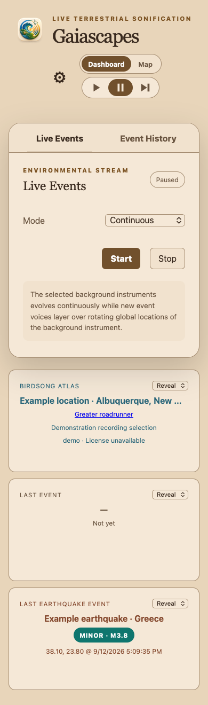
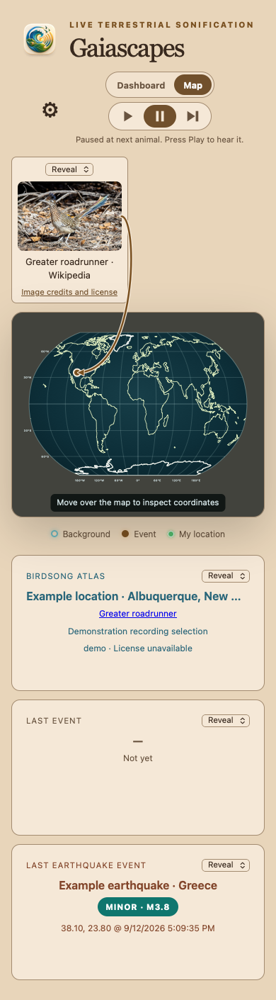
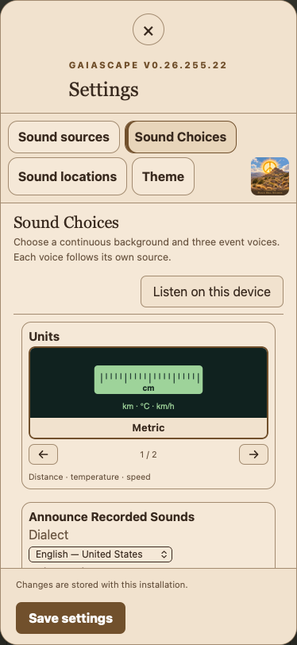
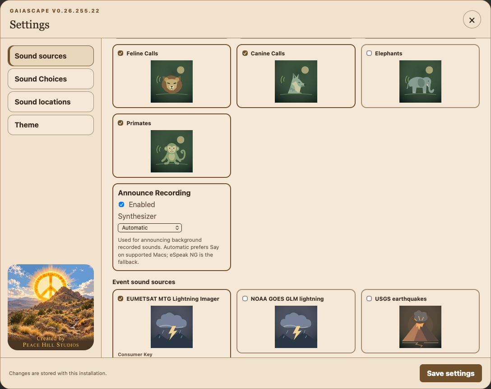
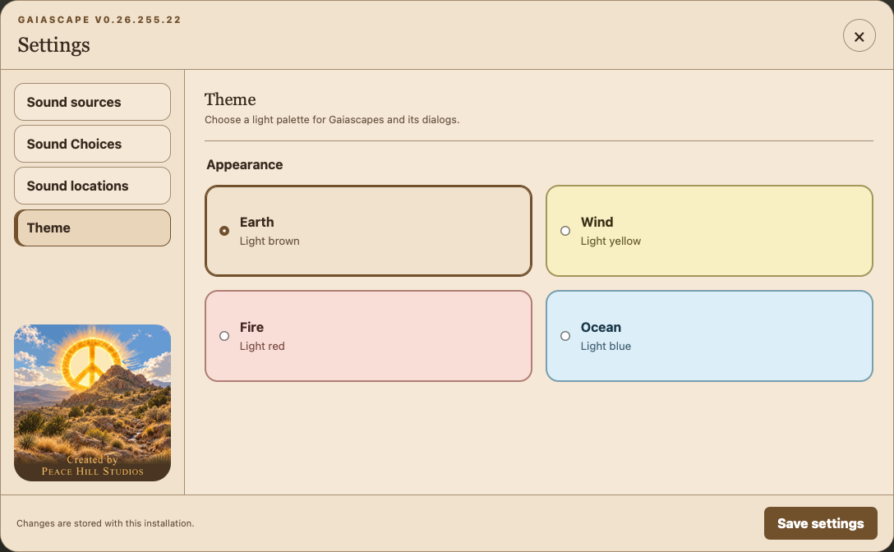
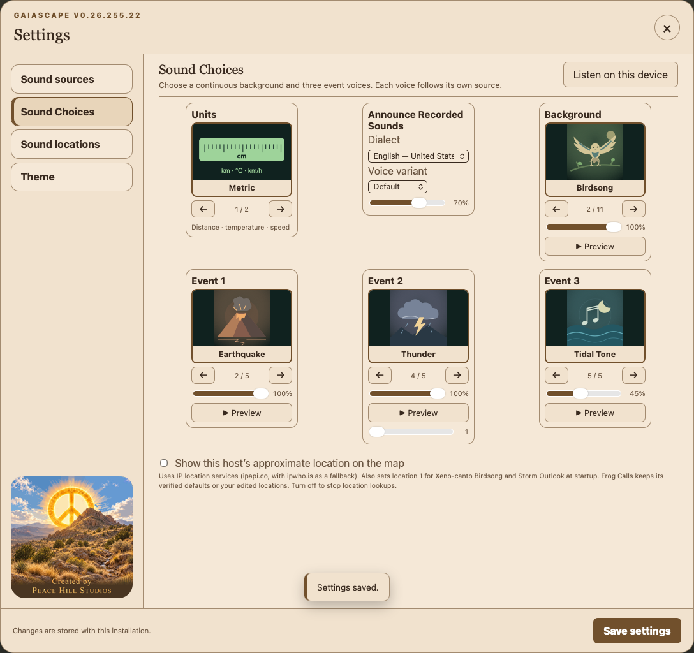
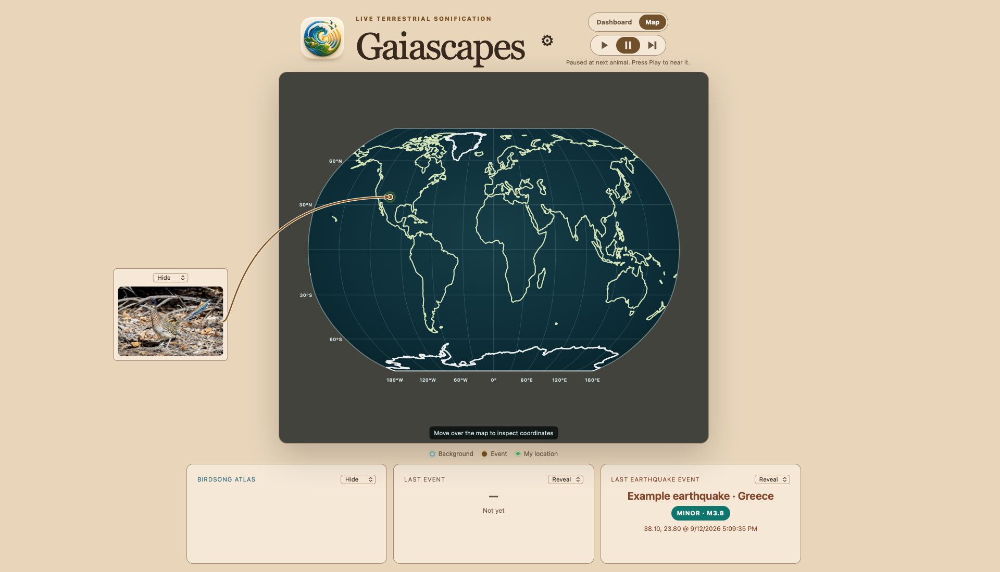

# Gaiascapes user guide

This guide explains the controls in Gaiascapes **v0.26.255.22**. Installation and system setup are covered separately in the [README](README.md).

The screenshots below were captured from this release on September 12, 2026, in an isolated demonstration session. Desktop screenshots use a 1,440-pixel-wide browser (1,920 pixels for the bird map views); mobile screenshots use a 390-pixel-wide browser simulation, not a physical iPhone. Settings screenshots focus on the dialog. Some lists scroll within the dialog, so only their visible rows are shown. Example earthquakes and the selected bird recording location are illustrative, not live observations. The bird views show a paused, image-only selection using Next. Credential fields are blank, and enabled switches in a screenshot demonstrate the controls rather than confirm access to a provider.

## Contents

- [Dashboard, playback, and history](#dashboard-playback-and-history)
- [Map view](#map-view)
- [Mobile and iPhone Home Screen](#mobile-and-iphone-home-screen)
- [Sound sources](#sound-sources)
- [Obtaining credentials](#obtaining-credentials)
- [Sound Choices](#sound-choices)
- [Sound locations](#sound-locations)
- [Theme](#theme)
- [Saving settings](#saving-settings)
- [Gaiascapes Game](#gaiascapes-game)
- [Status and troubleshooting](#status-and-troubleshooting)
- [Location privacy](#location-privacy)

## Dashboard, playback, and history

Use **Dashboard** for playback controls and history. Open Settings with the large, borderless **gear (⚙)**. On desktop, the gear and **Dashboard / Map** selector sit to the right of the title in a centered header. Settings contains **Sound sources**, **Sound Choices**, **Sound locations**, and **Theme**. The version appears above the Settings heading.

### Listening from another device

Open `http://<Gaiascapes-host-IP>:8768` from a device on the same LAN, then tap
**Listen on this device** in **Settings → Sound Choices**, at the right of the Sound Choices heading. **Mute this device** stops playback
in that browser without stopping the performance, the host speakers, or other
listeners. New remote pages start silent; tap Listen again after reloading.
**Start** and **Stop** still control the shared performance on the host.

The host must be running and reachable from the listening device. Use the host’s LAN address, not `localhost` or `127.0.0.1`, on another device. The supplied launchers accept LAN connections on port **8768**; if the page will not open, check the host address, firewall, and whether the Wi-Fi network isolates clients. See [Ports and LAN access](README.md#ports) for host binding details. Listening uses the same web connection; no separate audio port needs to be opened on the LAN.

The browser combines live SuperCollider audio with the animal recordings served
by Gaiascapes. Only Gaiascapes audio is included. Update and restart both the
Gaiascapes server and its SuperCollider receiver before using this feature.
SuperCollider must run on the same host as the server. No loopback audio driver
or microphone permission is required. With SuperCollider disabled, Listen plays
animal recordings only and explains that limitation beside the button.

Keep the page open while listening. If the browser suspends audio or the
connection drops, the message beside Listen explains how to reconnect. Remote
playback has a short buffer and may lag the host speakers. Each browser controls
its own playback; listening locally as well as through host speakers can produce
an echo. Remote listeners do not advance the host's recording rotation.

Listening and muting take effect immediately and do not require **Save settings**. Closing Settings leaves device playback active. The relay supports up to **16 simultaneous listeners**; if it is full, mute an unused listener and retry.

### Mode and playback controls

| Control | What it does |
| --- | --- |
| **Mode: Capture** | Enabled environmental feeds continue collecting observations. **Start** creates a finite performance from stored observations in the selected history window. It does not start an ongoing wildlife-recording rotation. |
| **History window** | How far back to look for stored events, in hours. The range is **0.05–24 hours** (3 minutes–24 hours); the usual starting value is 2 hours. Changing it also refreshes the history list. |
| **Performance length** | How long the history replay lasts, in seconds. The range is **1–3,600 seconds**; the usual starting value is 120 seconds. Events are placed into this performance timeline. |
| **Mode: Continuous** | Plays new event sounds over one rotating background. Selecting this mode starts continuous playback. The history-window and performance-length fields are hidden because they apply to replay. |
| **Start** | In Capture mode, starts a history replay. In Continuous mode, starts or resumes ongoing playback. |
| **Stop** | Stops the current replay or pauses continuous sound. Enabled environmental feeds can continue collecting data. |

Ocean Swells and Storm Outlook normally advance to another background location approximately every **23 seconds**. Wildlife recordings use their audio length instead. Network searches and downloads can take longer. Wildlife recordings are archived audio, even while the app is in Continuous mode.

For **Birdsong, Frog Calls, Whale Song, and Dolphin Calls**, each location visit plays one complete recording once. Short recordings do not loop, and long recordings are not cut off after 23 seconds. The player requests the next location during the final **three seconds**, or final **10%** of a short clip, and fades between recordings while the outgoing clip finishes. A first-time download can leave a gap between clips. Keep a browser opened locally on the host, or the host’s desktop player, open for the recording rotation to advance. A remote listening browser does not advance that rotation. **Preview** remains an eight-second sample; **Stop** or changing the background can interrupt a recording.

Every recorded-sound catalog has **19 default locations**: Wikimedia Commons Birdsong, Xeno-canto Birdsong, Frog Calls, Whale Song, and Dolphin Calls. The first pass plays the first available recording at each location. The next pass plays the second recording at each location, and later passes continue through each location's list before wrapping. A location with one verified recording repeats it on each pass. Marine playback follows the included subset when you exclude sites.

### Event History

Select **Event History** to inspect recent activity. Rows show the event type, place, measurements or recording title, associated sound, and time. The list is a presentation of recent activity, not a complete inventory of downloaded recordings. Individual lightning flashes are omitted from the visible history list; they can still trigger sound and map activity.

### Status tiles

The same three separate status tiles appear below Dashboard and Map. On desktop they sit side by side along the bottom; on mobile they stack vertically:

| Card | Meaning |
| --- | --- |
| **Background** | Uses the selected sound’s name, such as Birdsong Atlas or Frog Calls. Shows the most recent matching location and its measurements or recording attribution. It also reports recording searches and lookup failures. |
| **Last Event** | The most recently presented event type and time. |
| **Last Earthquake Event** | The latest available earthquake location and details, including captured observations. |

A dash or **Not yet** means there is no matching event to display yet. A previous event can remain visible after playback stops; it is not evidence that sound is still playing.

## Map view

Select **Map** at the top of the window. Select **Dashboard** to return to the playback controls.

The legend distinguishes background locations, event locations, and **My location**. Moving the pointer over the map displays coordinates. The system-location marker, when available, shows the host’s approximate location derived from its public IP address. Background locations come from **Sound locations**; the host location can seed location 1 for Xeno-canto Birdsong and Storm Outlook at startup (see [Location privacy](#location-privacy)). The chosen Dashboard/Map view is remembered.

## Mobile and iPhone Home Screen

On narrow screens, the gear and Dashboard/Map selector appear in a centered row below the title. The status tiles stack beneath the main content. Scroll down to see all three tiles when they extend below the screen.

In Settings, the section buttons move above the content. The listening button is in the Sound Choices heading. Units, Announce Recorded Sounds, Background, and the event tiles stack below it. Scroll inside the settings content to reach the lower controls. The **×** remains in the dialog header and **Save settings** in its footer.

To add Gaiascapes to an iPhone Home Screen:

1. Open the running host’s LAN URL in **Safari**.
2. Open Safari’s **Share** menu and choose **Add to Home Screen**. If it is missing, use **Edit Actions** to add it.
3. Keep **Open as Web App** enabled if Safari offers that option, then tap **Add**. See [Apple’s Home Screen web-app instructions](https://support.apple.com/en-gb/guide/iphone/iphea86e5236/ios).
4. Open the new Gaiascapes icon and use **Settings → Sound Choices → Listen on this device** to enable audio.

Gaiascapes supplies its app artwork for the Home Screen icon. If an existing shortcut still shows a letter, remove that shortcut and add it again from the refreshed site after updating the host. The Home Screen app still connects to the running host; it is not an offline installation. Keeping the phone on the LAN is required, and backgrounding or locking the phone may interrupt audio.

## Sound sources

Open **Settings → Sound sources**. Background sources appear above event sources, and tiles are alphabetized within each group. Click a checkbox or its artwork to enable or disable that source. Hover over a title, or focus its checkbox, for its explanation.

**Sound sources** determines which providers are available. **Sound Choices** determines which of their sounds play. Enabling several background sources does not mix them together: there is one Background sound selection. Save source changes before using Preview.

**Feline Calls, Canine Calls, Elephants, and Primates** each have an animal tile
with an enable checkbox in Background sound sources and an entry in the Sound
Choices Background selector. They are disabled initially. The bundled starter pack contains nine recordings:
lion and tiger; dingo, fox, and coyote; one elephant soundscape; bonnet macaque
and two howler monkey recordings. Enable the desired source and select it as
Background to play it. No key or recording download is needed.

**Proof-of-concept limitation:** the current elephant clip has been reported as
dominated by other wildlife rather than a usable elephant call. It needs
replacement and is not an approved elephant example; the source remains
disabled by default.

These groups use only fixed recording sites, with no user-selectable locations.
Sequential/Random, Preview, Next, images, and announcements use those sites.
Zoo and other recording context appears in the status information. Broader
animal labels are used where species identification is unresolved. See the
[recording credits and curation notes](src/gaiascapes_host/recordings/MAMMAL_CREDITS.md).
**Announce Recording** is the last background source tile.

### Background sources

| Source tile | What it supplies | Credentials and additional settings |
| --- | --- | --- |
| **Birdsong** | Archived bird recordings. The **Birdsong source** selector chooses Wikimedia Commons or Xeno-canto. | **Wikimedia Commons:** no key; uses 19 curated locations. **Xeno-canto:** shared API key; uses 19 editable regions with searches within 100 km of each center. |
| **Dolphin Calls** | Dolphin recordings from NOAA and other verified archives at 19 locations. | No key. Select included sites in Sound locations. |
| **Frog Calls** | Xeno-canto frog and toad recordings near the chosen region centers. | The same Xeno-canto API key as Birdsong. Its 19 region centers are edited independently of Birdsong. |
| **Open-Meteo Storm Outlook** | Forecast conditions used to generate a storm background. | No key. Uses the 19 Storm Outlook locations. This is forecast convection, not observed lightning. |
| **Open-Meteo surf & tides** | Modeled ocean swells and tide turns. | No key. Uses the 19 Ocean Swells locations. Supplies both the Ocean Swells background and events for Tidal Tone. |
| **Whale Song** | NOAA whale songs and calls from several species at 19 locations. | No key. Select included sites in Sound locations. |

NOAA marine recordings come from the [NCEI passive acoustic archive](https://www.ncei.noaa.gov/products/passive-acoustic-data). Gaiascapes caches selected recordings locally and retains their source attribution. A first use can require a download; subsequent uses can reuse the cache.

### Event sound sources

| Source tile | What it supplies | Credentials |
| --- | --- | --- |
| **EUMETSAT MTG Lightning Imager** | Observed lightning flashes covering Europe and Africa, used by Thunder. | **Consumer Key** and **Consumer Secret**, obtained through EUMETSAT. |
| **NOAA GOES GLM lightning** | Observed total-lightning flashes from GOES-East and GOES-West, used by Thunder. | No API key. |
| **USGS earthquakes** | Earthquake observations, used by Earthquake and Seismic Tone. | No API key. |

Credentials are required only for **Birdsong using Xeno-canto**, **Frog Calls**, and **EUMETSAT MTG Lightning Imager**. There is no credential field for the other sources.

## Obtaining credentials

### Xeno-canto: one key for Birdsong and Frog Calls

1. Open [Xeno-canto](https://xeno-canto.org/) in your browser and sign in, or register an account. Complete any email-verification step requested by the site.
2. Open [Your account](https://xeno-canto.org/account) and locate your API key. The [official API page](https://xeno-canto.org/explore/api) provides the provider’s current API guidance. These pages may require sign-in or a browser verification check.
3. In Gaiascapes, open **Settings → Sound sources**.
4. Either enable **Birdsong**, choose **Xeno-canto** in **Birdsong source**, and enter the key; or enable **Frog Calls** and enter it in that tile’s **Xeno-canto API key (shared)** field.
5. Click **Save settings**. One saved key serves both sources. Replacing it in either field changes the shared key.

Leave the key field blank when you want to keep the saved key. After a successful save, the field clears and its placeholder indicates that a key is saved. Birdsong using Wikimedia Commons does not need this key.

The account-page link is also documented by the [rOpenSci suwo reference](https://docs.ropensci.org/suwo/articles/suwo.html). Xeno-canto blocked automated inspection of its account pages during preparation of this guide, so exact account-page wording could not be checked. No user credentials or recording API requests were used to prepare these instructions.

### EUMETSAT: Consumer Key and Consumer Secret

Scroll down in Sound sources if the credential fields are below the visible area.

1. Open the [EUMETSAT User Portal sign-in page](https://user.eumetsat.int/cas/login). Choose **Register – Create new account** if needed, then complete registration and sign in.
2. Open the [EUMETSAT Data Store](https://data.eumetsat.int/).
3. Open the menu under your username and select **API Key**. You can also open [API key management](https://api.eumetsat.int/api-key/) directly after signing in.
4. Under **User Credentials**, reveal and copy the **Consumer Key** and **Consumer Secret**. Use these two values, rather than the temporary access token.
5. In Gaiascapes, enable **Settings → Sound sources → EUMETSAT MTG Lightning Imager**, paste the two values into the matching fields, and click **Save settings**.

EUMETSAT illustrates these steps in its [Introductory Data Store user guide](https://user.eumetsat.int/resources/user-guides/introductory-data-store-user-guide). If access is denied after authentication, check the account’s applicable data licences using the [registration and licensing guide](https://user.eumetsat.int/resources/user-guides/data-registration-and-licensing).

Blank credential fields preserve their saved values. The **Saved — enter only to replace** placeholder indicates that credentials are stored. Gaiascapes handles token acquisition; you do not need to paste a generated token into the app.

## Sound Choices

Open **Settings → Sound Choices**. The listening button is on the right of the heading. The first row contains **Units**, **Announce Recorded Sounds**, and **Background**. Below it are three independent event tiles: **Event 1**, **Event 2**, and **Event 3**. The location-privacy checkbox is beneath the sound tiles. These controls stack on narrow screens.

### Selecting a sound

Use the left and right arrows beneath a tile’s artwork to move through choices. Each sound list starts with **None**, followed by the remaining choices in A–Z order. The position indicator shows the selected item’s position and the number of choices. You can also use Left/Right while a sound card has keyboard focus; Home goes to the first choice and End to the last.

Each role has its own **volume slider**, from **0–100%**. Zero mutes that role. Select **None** to leave the role unassigned. Adjusting one role’s volume does not change the others. Every slider uses the same squared response curve: 10% gives −40 dB, 50% gives −12 dB, and 90% gives about −1.8 dB relative to that sound at 100%. Save updates sounds already playing as well as subsequent cues; Preview uses the displayed level. Synthesized voices receive gain independently of their musical velocity, including an exact zero target for mute. Different instruments and recordings still have different natural loudness.

Recorded birds, frogs, whales, and dolphins are automatically volume-normalized before playback, including previews. Louder recordings are reduced toward a quiet background level (−30 dBFS gated RMS); quiet recordings are never boosted. Peak protection also controls transitions without adding gain. The Background volume slider controls the listening level directly through Web Audio with a squared gain curve: 10% is −40 dB relative to full volume, 50% is −12 dB, and 100% is the full normalized level. Saving applies its new level immediately to the recording already playing, including during transitions. At zero volume, recordings continue advancing silently; saving a higher volume restores sound without waiting for the recording to finish. The browser analyzes each recording on first use, which can briefly delay playback, and remembers its level for the current page session. Original recordings are unchanged. This uses gated RMS loudness estimation, so recordings with very different frequency content may still sound somewhat different in loudness. A browser that cannot analyze a recording shows a playback error instead of playing it at an uncontrolled level.

**Preview** tries the displayed sound at the displayed volume. On another device, enable **Listen on this device** first to hear previews there. Synthesized previews also play through the host renderer. Recorded wildlife previews last approximately eight seconds. Preview is disabled for None. Save source, credential, or region edits before previewing them; moving to another sound and previewing it does not itself save that sound as your normal selection.

### Units

Choose **Imperial** or **Metric** to control displayed measurements, such as distance, swell height, wind speed, and temperature where shown. The Units tile is a display preference, not an audio layer. Latitude and longitude remain geographic coordinates in either setting.

### Recorded sound announcements

In **Sound Sources**, enable **Announce Recording** below the Background sources
and choose its **Synthesizer**. Automatic prefers Say on supported Macs; Say also
falls back to eSpeak NG when the chosen native voice is unavailable. Select
eSpeak NG to always use that engine. In **Sound Choices → Announce Recorded Sounds**,
choose a **Dialect** and **Voice variant** (Default, Male, or Female), set the volume
at the bottom, and save settings. Each newly played animal
recording announces its species and named location before the animal audio starts.
The previous animal sound stops before speech, so speech and animal audio do not
overlap. Disabled announcements retain the usual recording transitions. If speech
fails, its error is shown and the animal recording still plays. Coordinate-only locations
are skipped. Dialects change pronunciation; names use the original recording
metadata and are not translated. The default is disabled, US English, 70% volume.

Announcements use Say or eSpeak NG on the host; see the [installation instructions](README.md).
No speech service or network API is required. SuperCollider is needed only for Say. Muting this device,
stopping playback, or moving to another recording cancels its current announcement.
The tile reports a missing engine, missing voice, or synthesis failure while
recorded sound playback remains available.

On macOS, Say starts a short-lived SuperCollider language (`sclang`) worker for
each uncached announcement. A second SuperCollider Dock icon may appear briefly
while it generates speech; it is not loading the animal recording. Choosing
**eSpeak NG** in **Sound sources → Announce Recording → Synthesizer** avoids that
extra process. Repeated announcements may use the in-memory speech cache.

### Background choices

| Choice | Sound and dependency |
| --- | --- |
| **None** | No continuous background. Event voices can still play. |
| **Birdsong** | Plays recordings from the provider chosen in the Birdsong source tile. |
| **Dolphin Calls** | Plays curated dolphin recordings from the included sites. |
| **Frog Calls** | Plays Xeno-canto frog recordings from the configured regions. |
| **Ocean Swells** | Generates a background from modeled swell conditions; requires Open-Meteo surf & tides. |
| **Storm Outlook** | Generates a background from forecast storm conditions; requires Open-Meteo Storm Outlook. |
| **Whale Song** | Plays curated whale songs and calls from the included sites. |

Birdsong, Frog Calls, Whale Song, and Dolphin Calls play through the browser or desktop web view. Ocean Swells, Storm Outlook, and the event voices use the configured SuperCollider renderer. A working recording preview therefore does not by itself confirm that synthesized sounds are available.

### Event 1, Event 2, and Event 3

Each slot offers the same choices. Slot numbers do not restrict which source it follows.

| Choice | Trigger |
| --- | --- |
| **None** | Leaves this event slot silent. |
| **Earthquake** | USGS earthquake observations, rendered as a low-frequency earthquake sound. |
| **Seismic Tone** | USGS earthquake observations, rendered as a tonal voice. |
| **Thunder** | Observed lightning from enabled NOAA GOES GLM and/or EUMETSAT MTG sources. Storm Outlook forecasts do not trigger it. |
| **Tidal Tone** | Modeled tide-turn events from Open-Meteo surf & tides. |

Selecting the same sound in multiple event slots creates multiple voices for matching events, each with its own volume. It does not select different geographic regions for those slots.

An older saved configuration may show **Retired sound**. It remains available as the current selection until you choose a replacement; it is not a new sound to configure.

### Lightning sample rate

A **lightning sample rate** slider appears under event slots assigned to Thunder. Its range is **1–11**. A value of 1 uses every available flash selected for sonification; larger values thin the sound stream to approximately every Nth flash. For example, 5 is roughly one in five. This reduces sound density, rather than changing audio quality or the provider’s polling interval.

The setting is shared: changing it under one Thunder slot updates the other visible sample-rate sliders. Each event slot’s volume remains independent.

## Sound locations

Open **Settings → Sound locations**. The catalog tabs are alphabetized: Birdsong, Dolphin Calls, Frog Calls, Ocean Swells, Storm Outlook, and Whale Song. Selecting a tab edits that sound’s locations; it does not change the Background choice.

### Editable location catalogs

Ocean Swells, Storm Outlook, Frog Calls, and Birdsong using Xeno-canto each have **19 locations**. These catalogs are independent.

1. Choose the sound’s tab.
2. Select a numbered map marker or the numbered button beside a location in the list. The list is alphabetized by location name; the number links the row to its map marker.
3. Click another position on the map to move the selected location, or edit its **Lat** and **Lon** fields directly.
4. Edit **Name** to give it a meaningful label. Moving a point on the map initially labels it with its new coordinates. Names can be up to 80 characters.
5. Click **Save settings** to apply the edited catalog.

Latitude ranges from **−90 to 90**; longitude ranges from **−180 to 180**. Negative values mean south and west. Keep 19 distinct locations. Ocean Swells points should be at appropriate marine locations; a point on land may not produce usable marine forecasts.

For **Frog Calls** and **Xeno-canto Birdsong**, each point is a search center with a **100 km radius**. A named region is not a guarantee that suitable recordings exist there. The displayed playback location comes from the actual recording metadata, so it can differ from the center you entered. Frog searches accept short and ungraded recordings with supported CC BY or CC BY-SA licenses; availability still depends on geographic coverage and usable metadata.

### Birdsong using Wikimedia Commons

Commons uses **68 recordings across 19 curated locations**, with multiple recordings at 17 locations and a single verified recording at two. Each return to a location advances to its next recording. Names and coordinates are read-only, and Restore defaults is disabled for this view. To use editable Birdsong regions, choose **Xeno-canto** in the Birdsong source tile and provide the shared key. Gaiascapes retains the separate Xeno-canto location catalog when you switch providers.

### Whale Song and Dolphin Calls

These tabs list verified archive sites, not movable search centers. Use **Include in playback** to include or exclude a site from the rotation. Keep at least one site selected. The count shows how many sites are included. The numbered button or map marker identifies the site; the checkbox controls whether it plays. Names and coordinates are read-only.

| Catalog | Available sites and regions |
| --- | --- |
| **Whale Song** | **19 sites**, with 59 recordings: California, Hawaiian Islands, Olympic Coast, Gray’s Reef, Papahānaumokuākea, and Stellwagen Bank. |
| **Dolphin Calls** | **19 sites**, with 30 recordings: the original 11 NOAA sites plus Australia, Italy, Spain, Portugal, Brazil, Mexico, China, and MBARI MARS. |

Map points identify documented recording locations or approximate study regions, not exact animal positions. Site codes such as HI01 distinguish NOAA recording stations. Each site lists its recording count; single-recording sites repeat on each pass. Playback visits included sites and rotates through available clips at a site. These recordings are archived examples; they are not live hydrophone streams or worldwide searches.

### Restore defaults and Projection Model

**Restore defaults** resets the active catalog in the editor. For editable catalogs, it restores the default 19 points. For Whale Song and Dolphin Calls, it includes every available site again. Click **Save settings** to persist the reset. It does not reset every sound’s catalog at once.

**Projection Model** changes both the main map and the location editor:

| Projection | Appearance |
| --- | --- |
| **Robinson** | A familiar rounded world map balancing the shapes of continents and oceans. |
| **Eckert IV** | An equal-area world map, useful when comparing the relative areas of regions. |

Changing projection does not move stored geographic coordinates or change which region supplies sound. Save settings to retain the preference.

## Theme

Open **Settings → Theme** and choose **Earth** (light brown), **Wind** (light yellow), **Fire** (light red), or **Ocean** (light blue). The palette applies to the main view and dialogs immediately, and a **Theme applied.** notification confirms the change.

Theme is remembered in this browser’s local storage and does not require **Save settings**. Each browser can use its own theme. If browser storage is unavailable, the notification explains that the selection cannot be remembered after reload.

## Saving settings

Click **Save settings** after editing Sound sources, Sound Choices, or Sound locations. The button saves changes across all three sections, not just the visible one. The button shows **Saving…** while the request is in progress. Look for the **Settings saved.** toast before closing the dialog. Success and failure notifications for saving, previewing, restoring defaults, and changing theme dismiss automatically after **five seconds**, or immediately when clicked. Source recovery toasts follow the same behavior. A newer result replaces the previous notification and starts a fresh five-second interval. Errors begin with **Error:**; resolve the reported problem and save again. Earlier parts of a save may already have been applied.

Use the **×** in the dialog header to close Settings; there is no Close button beside Save. Escape or clicking outside the dialog also closes it. Closing is not a save action. Unsaved edits may remain visible when you reopen Settings in the same page, so they should not be treated as a saved configuration. Reloading the page restores the saved settings.

Mode and Dashboard/Map view changes are applied and saved immediately through their own controls. Theme is saved immediately in this browser. Listen/Mute applies only to the current page session. History-window and performance-length values control the current replay request and are not saved by the Settings dialog.

## Gaiascapes Game

Turn an animal background into an identification quiz: show the picture first,
offer the recording as a second clue, then reveal the answer. One person hosts
the game and controls when clues and answers appear.

### Set up the quiz

Complete setup before showing the screen to the players.

1. In **Settings → Sound sources**, enable the animal recording source you want
   to use. Clear **Enabled** under **Announce Recording** so spoken names will
   not give away the answer.
2. In **Sound Choices**, select that animal source as **Background**. Set
   **Event 1**, **Event 2**, and **Event 3** to **None** to avoid unrelated sounds
   during the quiz. Set a comfortable Background volume and save settings.
   If needed, select **Listen on this device** for the browser presenting the quiz.
3. In **Sound locations**, set **Sound location order** to **Random**, then save.
   Random changes the order of sites within the selected background collection;
   it does not mix different background sound choices. Mammal sources keep their
   fixed recording sites.
4. On the Dashboard, select **Continuous** mode, then **Pause**. Switch to
   **Map** if you want the recording location to be a visual clue.
5. Set the background status tile’s **Reveal / Hide** selector to **Hide**.
6. Press **Next** to prepare the first animal without playing its sound. Once
   the picture card appears, set its selector to **Hide** too. The picture and
   location pointer stay visible, but its caption and credits are concealed.

The screen is now ready for the players. Keep the picture card’s Wikipedia
article closed until you are ready to reveal the answer.

### Play a round

1. **Guess from the picture.** Next displays the animal picture and pauses.
   Give everyone a chance to identify it without hearing the recording.
2. **Offer the sound if needed.** If nobody knows, press **Play** to hear the
   same animal. Announcements are disabled, so players hear the animal rather
   than its name. Press **Pause** after a useful clue; Play resumes continuous
   playback, which can otherwise advance to another recording automatically.
3. **Reveal the answer.** When someone identifies the animal correctly—or no
   one can identify it—select **Reveal** on the picture card and background
   status tile. Read the displayed animal name and recording location together.
   Some recordings identify only a broad animal group; use the displayed name
   as the answer rather than requiring an unsupported exact species.
4. **Prepare the next round.** Return both selectors to **Hide**, then press
   **Next**. The next animal appears silently, with its information still hidden.
   Repeat the picture, sound, and reveal sequence.

Reveal/Hide choices remain in effect as animals change, but reloading the page
resets them to Reveal. If you reload, hide both sets of information again before
continuing. To change the animal category, choose another enabled Background
in Sound Choices, save, and prepare the next round with Next.

### Game controls

Use the Play, Pause, and Next icons beneath Dashboard/Map to start or pause the selected
Gaiascapes session from either view. It follows the existing mode: Continuous
starts/stops the live soundscape; Capture starts a history replay and Pause stops
it (Play starts a new replay). Device listening remains a separate setting.

Each status tile has a **Reveal / Hide** selector beside its title. Reveal is the
default. Hide conceals its information, links, and detail tooltip while keeping
the title and equal-sized tile visible. Choices stay synchronized between Map
and Dashboard for the current page; reloading returns to Reveal. New status
updates remain hidden until the player selects Reveal.

### Sound location order

In **Sound locations**, choose **Sequential** (the default) or **Random** above
Projection Model, then save settings. Random visits each background location once
per shuffled round, then reshuffles; recordings continue to the next clip at each
site on subsequent rounds. It applies to birds, frogs, whales, dolphins, the mammal collections, ocean
swell, and storm outlook. Actual recording coordinates remain unchanged.
Realtime volcano, seismic, thunder/lightning, and tidal events are not randomized.
Changes take effect on the next background visit without interrupting a recording.

The animal image tile has its own top-center **Reveal / Hide** selector, initially
Reveal. Hide conceals the caption and credits while keeping the image and its
map pointer visible; it stays selected
as animals change. **Next** stages the next animal in the configured Sequential
or Random order and pauses without playing its announcement or recording. Once
the image is ready, Pause is highlighted. **Play** plays that staged animal.
Next requires Continuous mode and an enabled animal recording background.

## Status and troubleshooting

| What you see or hear | What it means and what to check |
| --- | --- |
| **Remote page will not open** | Verify the host is running, use its LAN IP with port 8768, and check firewall and Wi-Fi client isolation. |
| **Listening stops after locking the phone or switching apps** | Return to Gaiascapes and follow the message beside Listen to reconnect. Browser audio can be suspended in the background. |
| **No background selected** | Background is set to None. |
| **Awaiting background** | No matching background cue is available yet. This alone does not identify a provider failure. Check that playback is running and the source is enabled. |
| **Looking for … recordings…** | A recording lookup or download is underway. First-use requests can take longer than cached playback. |
| **No suitable recordings … within 100 km …** | The lookup completed without a recording that meets the region and compatibility requirements. Continuous playback advances to the next region on a later cycle. Adjust a search center if needed; the app does not substitute another animal group or a recording outside the region. |
| **Rejected key, denied access, or rate limit** | Check the credential instructions above. Respect a displayed retry delay. Replacing the shared Xeno-canto key affects both Birdsong and Frog Calls. |
| **Preview reports a provider error** | Source selection, credentials, geography, or download availability prevented a preview. The error should explain the reason. |
| **Recording is ready, but silent** | Check the Background volume, media volume, and browser/site audio permissions. On a remote device, tap Listen on this device to permit playback. Gaiascapes requests a media playback session on supported browsers so iPhone Silent Mode does not mute explicit listening. With an older browser or app version, try turning Silent Mode off, then reconnect. |
| **Recordings work but synthesized sounds are silent** | For LAN listening, restart the updated SuperCollider receiver on the Gaiascapes host and tap Listen again. Check the configured renderer and audio output for host playback. |
| **Event voices are quiet while the background plays** | Events are intermittent. Check the event slots, their volumes, and their corresponding source switches. Thunder requires observed lightning; Tidal Tone requires a modeled tide turn. |
| **A saved sound has no effect** | Confirm the save succeeded and inspect the running version. The app can only show features present in that running release. |

Automatic source-recovery notices can appear when an environmental feed fails or recovers. A source problem does not necessarily stop other enabled sources. A cached recording can remain playable even while new network lookups are unavailable.

## Location privacy

In **Settings → Sound Choices**, clear **Show this host’s approximate location
on the map** and save to stop IP-based location lookups. This hides the host
marker without changing environmental events, audio, or LAN access. The marker refers to the Gaiascapes host, not the phone or other listening device. When enabled, IP location also sets the initial location 1 for Xeno-canto Birdsong and Storm Outlook at startup; Frog Calls retains its verified defaults or edited regions. The setting
applies to the installation; other open browsers may need a refresh to remove
a previously displayed marker. See [Privacy](PRIVACY.md) for details.

## Screenshot image credit

The bird image visible in the map screenshots is
[Greater Roadrunner Tingley Beach](https://commons.wikimedia.org/wiki/File:Greater_Roadrunner_Tingley_Beach.jpg)
by Polinova (Daniel Polin), licensed under
[CC BY-SA 4.0](https://creativecommons.org/licenses/by-sa/4.0/).
It is shown scaled within the application without other photographic edits.
The photograph retains its license; the demonstration map location does not
identify the location of a verified sound recording.
