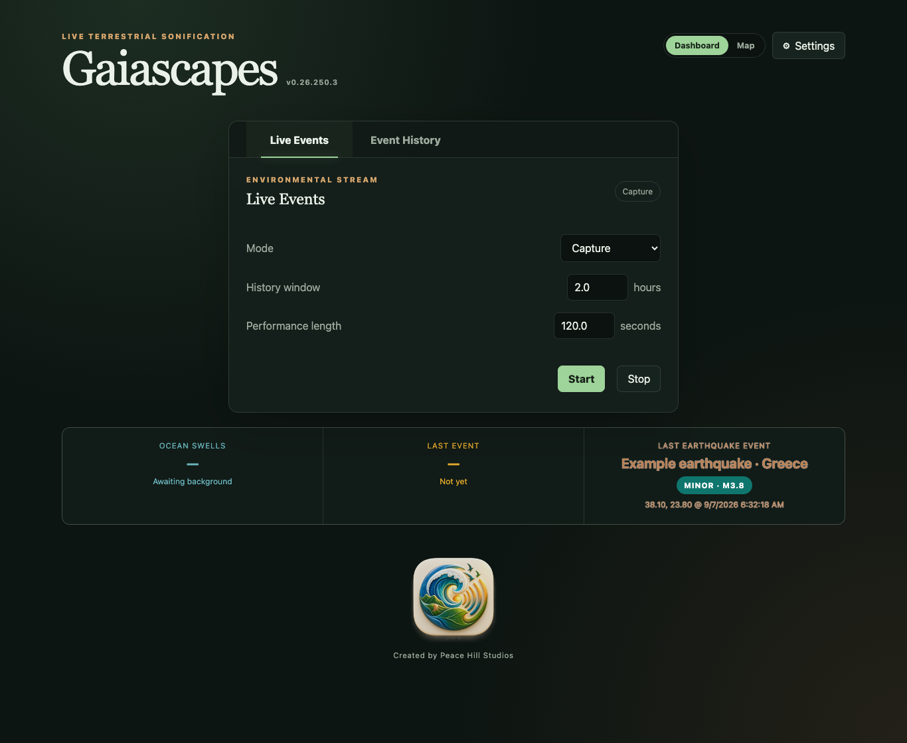
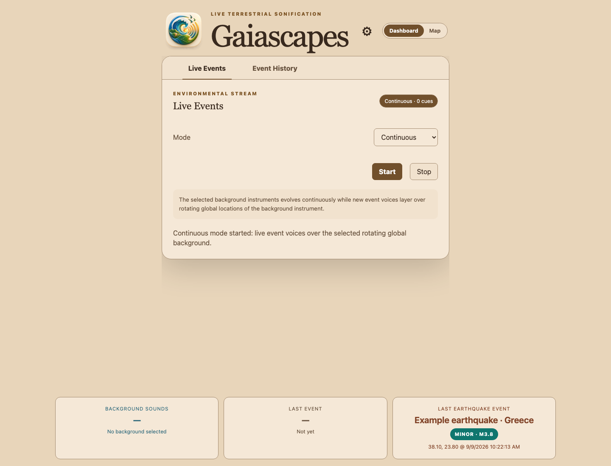
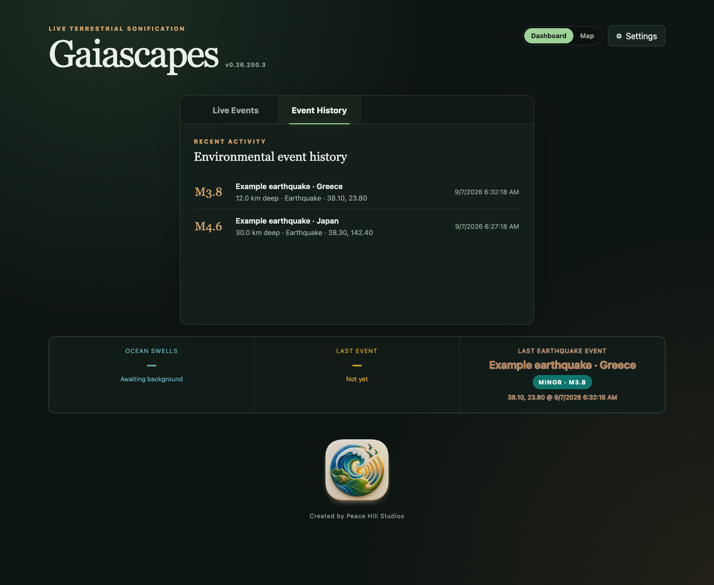
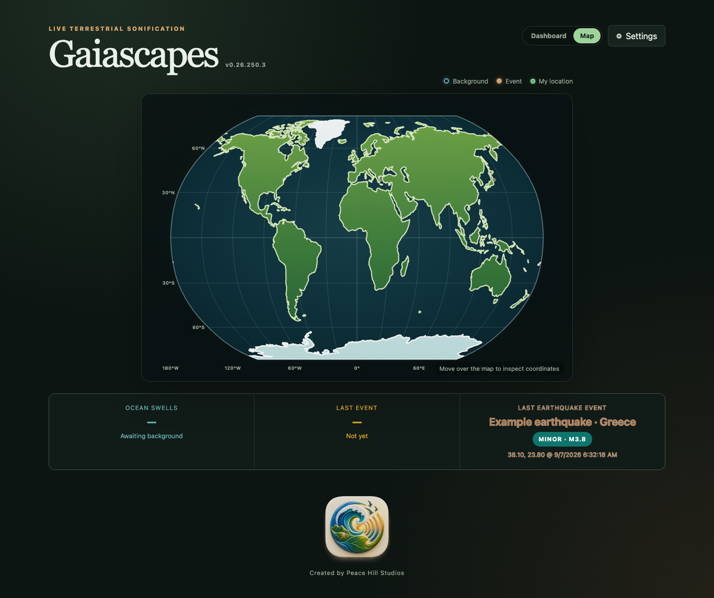
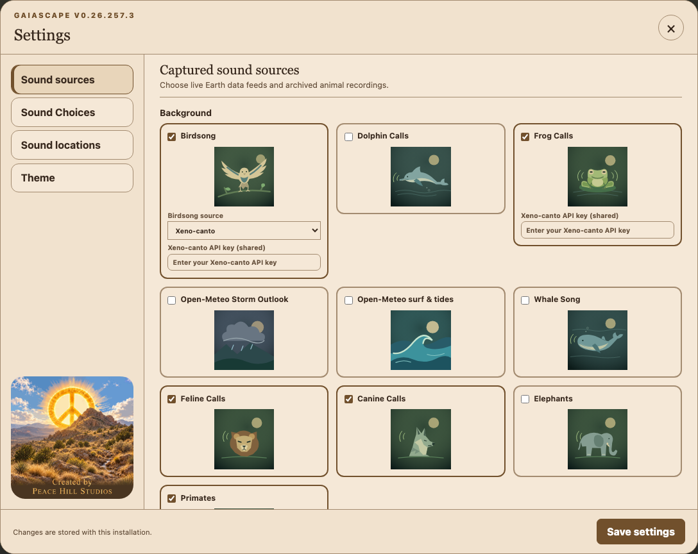
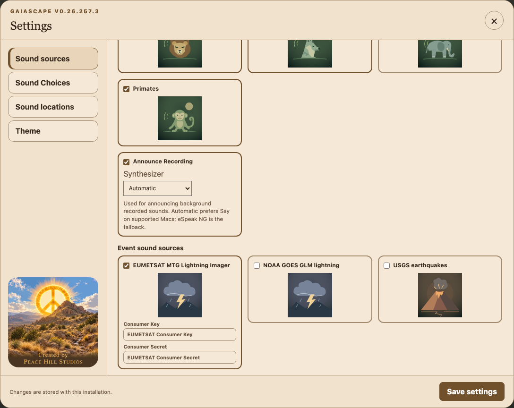
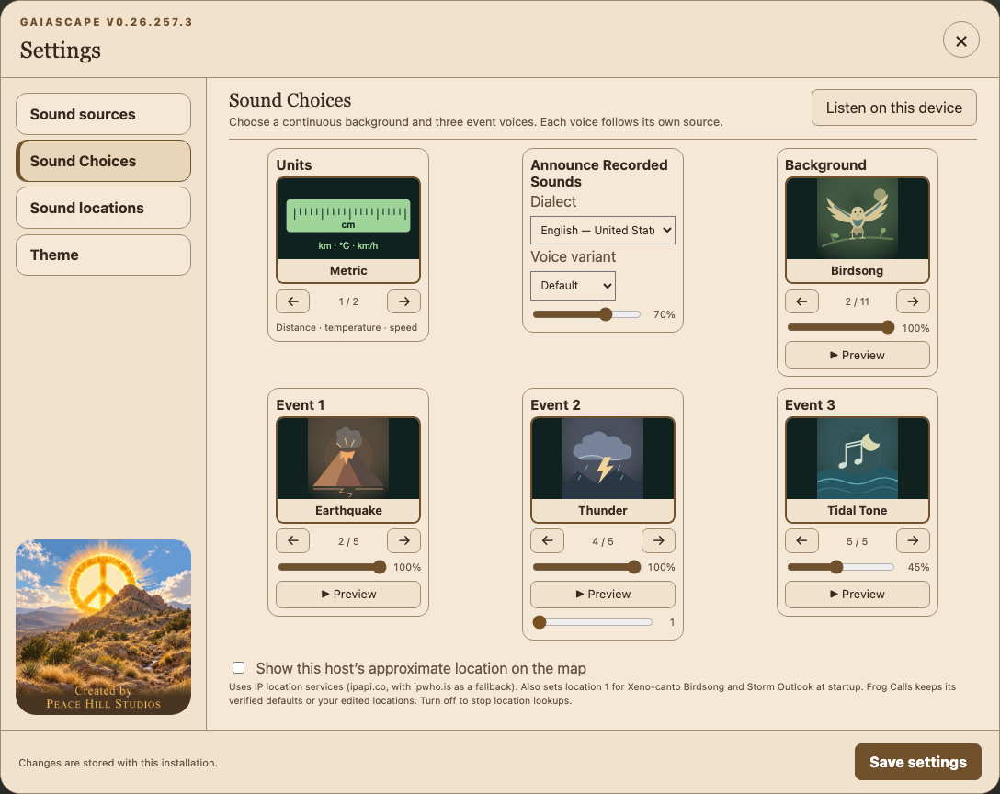
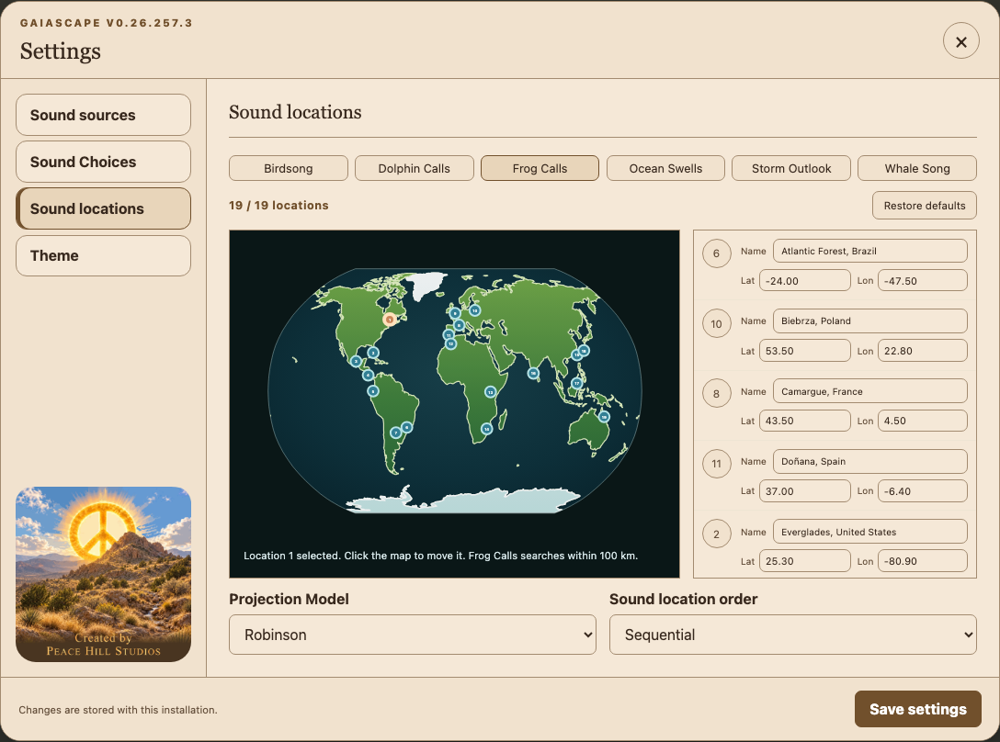
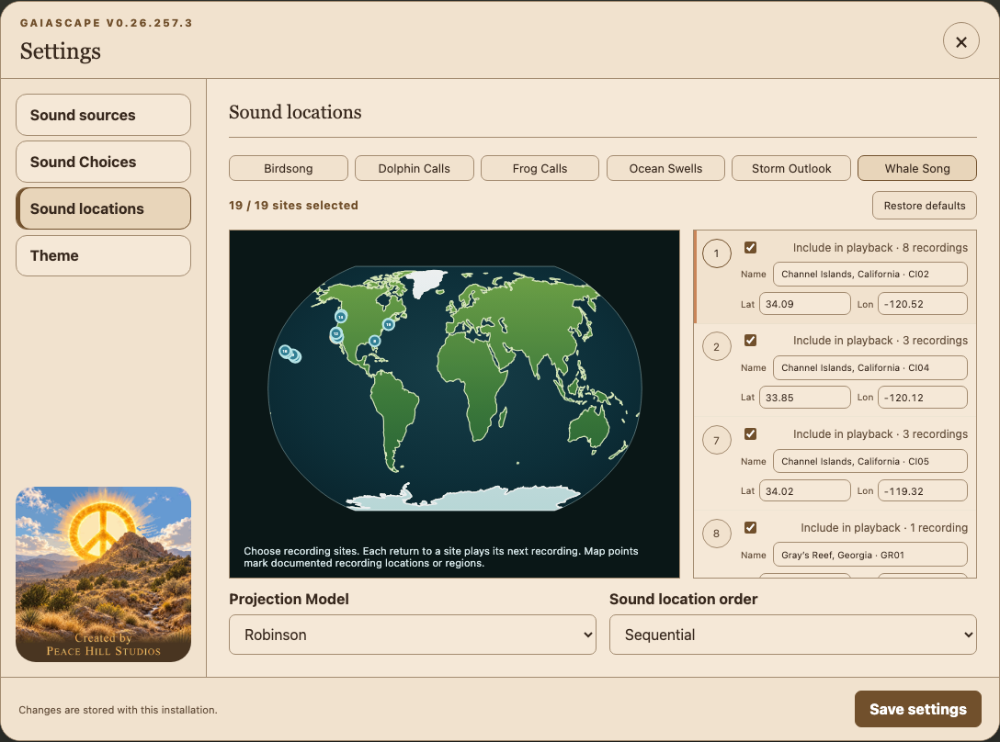
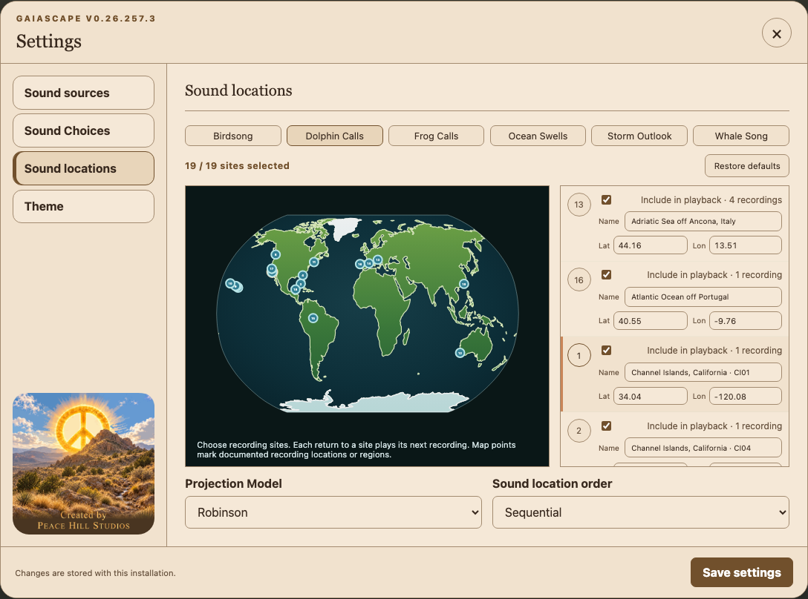

# Gaiascapes user guide

This guide explains the controls in Gaiascapes **v0.26.250.3**. Installation and system setup are covered separately in the [README](README.md).

The screenshots below were captured from the application in an isolated demonstration session. Example earthquakes are illustrative, not live observations. Credential fields are blank, and enabled switches in a screenshot demonstrate the controls rather than confirm access to a provider.

## Contents

- [Dashboard, playback, and history](#dashboard-playback-and-history)
- [Map view](#map-view)
- [Sound sources](#sound-sources)
- [Obtaining credentials](#obtaining-credentials)
- [Sound Choices](#sound-choices)
- [Sound locations](#sound-locations)
- [Saving settings](#saving-settings)
- [Status and troubleshooting](#status-and-troubleshooting)

## Dashboard, playback, and history

Use **Dashboard** for playback controls and history. **Settings** opens Sound sources, Sound Choices, and Sound locations. The version beside the application name identifies the running release.

### Mode and playback controls

| Control | What it does |
| --- | --- |
| **Mode: Capture** | Enabled environmental feeds continue collecting observations. **Start** creates a finite performance from stored observations in the selected history window. It does not start an ongoing wildlife-recording rotation. |
| **History window** | How far back to look for stored events, in hours. The range is **0.05–24 hours** (3 minutes–24 hours); the usual starting value is 2 hours. Changing it also refreshes the history list. |
| **Performance length** | How long the history replay lasts, in seconds. The range is **1–3,600 seconds**; the usual starting value is 120 seconds. Events are placed into this performance timeline. |
| **Mode: Continuous** | Plays new event sounds over one rotating background. Selecting this mode starts continuous playback. The history-window and performance-length fields are hidden because they apply to replay. |
| **Start** | In Capture mode, starts a history replay. In Continuous mode, starts or resumes ongoing playback. |
| **Stop** | Stops the current replay or pauses continuous sound. Enabled environmental feeds can continue collecting data. |

Continuous playback normally advances to another background location approximately every **23 seconds**. Network searches and downloads can take longer. Wildlife recordings are archived audio, even while the app is in Continuous mode.

### Event History

Select **Event History** to inspect recent activity. Rows show the event type, place, measurements or recording title, associated sound, and time. The list is a presentation of recent activity, not a complete inventory of downloaded recordings. Individual lightning flashes are omitted from the visible history list; they can still trigger sound and map activity.

### The status strip

The same three status cards appear below Dashboard and Map:

| Card | Meaning |
| --- | --- |
| **Background** | Uses the selected sound’s name, such as Birdsong Atlas or Frog Calls. Shows the most recent matching location and its measurements or recording attribution. It also reports recording searches and lookup failures. |
| **Last Event** | The most recently presented event type and time. |
| **Last Earthquake Event** | The latest available earthquake location and details, including captured observations. |

A dash or **Not yet** means there is no matching event to display yet. A previous event can remain visible after playback stops; it is not evidence that sound is still playing.

## Map view

Select **Map** at the top of the window. Select **Dashboard** to return to the playback controls.

The legend distinguishes background locations, event locations, and **My location**. Moving the pointer over the map displays coordinates. The system-location marker, when available, is an approximate location derived from the public IP address; it does not select the background’s region. Background locations come from **Sound locations**. The chosen Dashboard/Map view is remembered.

## Sound sources

Open **Settings → Sound sources**. Background sources appear above event sources, and tiles are alphabetized within each group. Click a checkbox or its artwork to enable or disable that source. Hover over a title, or focus its checkbox, for its explanation.

**Sound sources** determines which providers are available. **Sound Choices** determines which of their sounds play. Enabling several background sources does not mix them together: there is one Background sound selection. Save source changes before using Preview.

### Background sources

| Source tile | What it supplies | Credentials and additional settings |
| --- | --- | --- |
| **Birdsong** | Archived bird recordings. The **Birdsong source** selector chooses Wikimedia Commons or Xeno-canto. | **Wikimedia Commons:** no key; uses 19 curated locations. **Xeno-canto:** shared API key; uses 19 editable regions with searches within 100 km of each center. |
| **Dolphin Calls** | NOAA NCEI / SanctSound dolphin recordings from selected hydrophone sites. | No key. Select included sites in Sound locations. |
| **Frog Calls** | Xeno-canto frog and toad recordings near the chosen region centers. | The same Xeno-canto API key as Birdsong. Its 19 region centers are edited independently of Birdsong. |
| **Open-Meteo Storm Outlook** | Forecast conditions used to generate a storm background. | No key. Uses the 19 Storm Outlook locations. This is forecast convection, not observed lightning. |
| **Open-Meteo surf & tides** | Modeled ocean swells and tide turns. | No key. Uses the 19 Ocean Swells locations. Supplies both the Ocean Swells background and events for Tidal Tone. |
| **Whale Song** | NOAA NCEI / SanctSound humpback-song recordings from selected hydrophone sites. | No key. Select included sites in Sound locations. |

NOAA marine recordings come from the [NCEI passive acoustic archive](https://www.ncei.noaa.gov/products/passive-acoustic-data). Gaiascapes caches selected recordings locally and retains their source attribution. A first use can require a download; subsequent uses can reuse the cache.

### Event sound sources

| Source tile | What it supplies | Credentials |
| --- | --- | --- |
| **EUMETSAT MTG Lightning Imager** | Observed lightning flashes covering Europe and Africa, used by Thunder. | **Consumer Key** and **Consumer Secret**, obtained through EUMETSAT. |
| **NOAA GOES GLM lightning** | Observed total-lightning flashes from GOES-East and GOES-West, used by Thunder. | No API key. |
| **USGS earthquakes** | Earthquake observations, used by Earthquake and Seismic Tone. | No API key. |

Credentials are required only for **Birdsong using Xeno-canto**, **Frog Calls**, and **EUMETSAT MTG Lightning Imager**. There is no credential field for the other sources.

## Obtaining credentials

### Xeno-canto: one key for Birdsong and Frog Calls

1. Open [Xeno-canto](https://xeno-canto.org/) in your browser and sign in, or register an account. Complete any email-verification step requested by the site.
2. Open [Your account](https://xeno-canto.org/account) and locate your API key. The [official API page](https://xeno-canto.org/explore/api) provides the provider’s current API guidance. These pages may require sign-in or a browser verification check.
3. In Gaiascapes, open **Settings → Sound sources**.
4. Either enable **Birdsong**, choose **Xeno-canto** in **Birdsong source**, and enter the key; or enable **Frog Calls** and enter it in that tile’s **Xeno-canto API key (shared)** field.
5. Click **Save settings**. One saved key serves both sources. Replacing it in either field changes the shared key.

Leave the key field blank when you want to keep the saved key. After a successful save, the field clears and its placeholder indicates that a key is saved. Birdsong using Wikimedia Commons does not need this key.

The account-page link is also documented by the [rOpenSci suwo reference](https://docs.ropensci.org/suwo/articles/suwo.html). Xeno-canto blocked automated inspection of its account pages during preparation of this guide, so exact account-page wording could not be checked. No user credentials or recording API requests were used to prepare these instructions.

### EUMETSAT: Consumer Key and Consumer Secret

Scroll down in Sound sources if the credential fields are below the visible area.

1. Open the [EUMETSAT User Portal sign-in page](https://user.eumetsat.int/cas/login). Choose **Register – Create new account** if needed, then complete registration and sign in.
2. Open the [EUMETSAT Data Store](https://data.eumetsat.int/).
3. Open the menu under your username and select **API Key**. You can also open [API key management](https://api.eumetsat.int/api-key/) directly after signing in.
4. Under **User Credentials**, reveal and copy the **Consumer Key** and **Consumer Secret**. Use these two values, rather than the temporary access token.
5. In Gaiascapes, enable **Settings → Sound sources → EUMETSAT MTG Lightning Imager**, paste the two values into the matching fields, and click **Save settings**.

EUMETSAT illustrates these steps in its [Introductory Data Store user guide](https://user.eumetsat.int/resources/user-guides/introductory-data-store-user-guide). If access is denied after authentication, check the account’s applicable data licences using the [registration and licensing guide](https://user.eumetsat.int/resources/user-guides/data-registration-and-licensing).

Blank credential fields preserve their saved values. The **Saved — enter only to replace** placeholder indicates that credentials are stored. Gaiascapes handles token acquisition; you do not need to paste a generated token into the app.

## Sound Choices

Open **Settings → Sound Choices**. There is a Units tile, one Background tile, and three independent event tiles: **Event 1**, **Event 2**, and **Event 3**.

### Selecting a sound

Use the left and right arrows beneath a tile’s artwork to move through choices. Each sound list starts with **None**, followed by the remaining choices in A–Z order. The position indicator shows the selected item’s position and the number of choices. You can also use Left/Right while a sound card has keyboard focus; Home goes to the first choice and End to the last.

Each role has its own **volume slider**, from **0–100%**. Zero mutes that role. Select **None** to leave the role unassigned. Adjusting one role’s volume does not change the others.

**Preview** tries the displayed sound at the displayed volume. Recorded wildlife previews last approximately eight seconds. Preview is disabled for None. Save source, credential, or region edits before previewing them; moving to another sound and previewing it does not itself save that sound as your normal selection.

### Units

Choose **Imperial** or **Metric** to control displayed measurements, such as distance, swell height, wind speed, and temperature where shown. The Units tile is a display preference, not an audio layer. Latitude and longitude remain geographic coordinates in either setting.

### Background choices

| Choice | Sound and dependency |
| --- | --- |
| **None** | No continuous background. Event voices can still play. |
| **Birdsong** | Plays recordings from the provider chosen in the Birdsong source tile. |
| **Dolphin Calls** | Plays SanctSound dolphin recordings from the included sites. |
| **Frog Calls** | Plays Xeno-canto frog recordings from the configured regions. |
| **Ocean Swells** | Generates a background from modeled swell conditions; requires Open-Meteo surf & tides. |
| **Storm Outlook** | Generates a background from forecast storm conditions; requires Open-Meteo Storm Outlook. |
| **Whale Song** | Plays SanctSound humpback songs from the included sites. |

Birdsong, Frog Calls, Whale Song, and Dolphin Calls play through the browser or desktop web view. Ocean Swells, Storm Outlook, and the event voices use the configured SuperCollider renderer. A working recording preview therefore does not by itself confirm that synthesized sounds are available.

### Event 1, Event 2, and Event 3

Each slot offers the same choices. Slot numbers do not restrict which source it follows.

| Choice | Trigger |
| --- | --- |
| **None** | Leaves this event slot silent. |
| **Earthquake** | USGS earthquake observations, rendered as a low-frequency earthquake sound. |
| **Seismic Tone** | USGS earthquake observations, rendered as a tonal voice. |
| **Thunder** | Observed lightning from enabled NOAA GOES GLM and/or EUMETSAT MTG sources. Storm Outlook forecasts do not trigger it. |
| **Tidal Tone** | Modeled tide-turn events from Open-Meteo surf & tides. |

Selecting the same sound in multiple event slots creates multiple voices for matching events, each with its own volume. It does not select different geographic regions for those slots.

An older saved configuration may show **Retired sound**. It remains available as the current selection until you choose a replacement; it is not a new sound to configure.

### Lightning sample rate

A **lightning sample rate** slider appears under event slots assigned to Thunder. Its range is **1–11**. A value of 1 uses every available flash selected for sonification; larger values thin the sound stream to approximately every Nth flash. For example, 5 is roughly one in five. This reduces sound density, rather than changing audio quality or the provider’s polling interval.

The setting is shared: changing it under one Thunder slot updates the other visible sample-rate sliders. Each event slot’s volume remains independent.

## Sound locations

Open **Settings → Sound locations**. The catalog tabs are alphabetized: Birdsong, Dolphin Calls, Frog Calls, Ocean Swells, Storm Outlook, and Whale Song. Selecting a tab edits that sound’s locations; it does not change the Background choice.

### Editable location catalogs

Ocean Swells, Storm Outlook, Frog Calls, and Birdsong using Xeno-canto each have **19 locations**. These catalogs are independent.

1. Choose the sound’s tab.
2. Select a numbered map marker or the numbered button beside a location in the list. The list is alphabetized by location name; the number links the row to its map marker.
3. Click another position on the map to move the selected location, or edit its **Lat** and **Lon** fields directly.
4. Edit **Name** to give it a meaningful label. Moving a point on the map initially labels it with its new coordinates. Names can be up to 80 characters.
5. Click **Save settings** to apply the edited catalog.

Latitude ranges from **−90 to 90**; longitude ranges from **−180 to 180**. Negative values mean south and west. Keep 19 distinct locations. Ocean Swells points should be at appropriate marine locations; a point on land may not produce usable marine forecasts.

For **Frog Calls** and **Xeno-canto Birdsong**, each point is a search center with a **100 km radius**. A named region is not a guarantee that suitable recordings exist there. The displayed playback location comes from the actual recording metadata, so it can differ from the center you entered. Frog searches accept short and ungraded recordings with supported CC BY or CC BY-SA licenses; availability still depends on geographic coverage and usable metadata.

### Birdsong using Wikimedia Commons

Commons uses a fixed catalog of **19 curated locations**. Names and coordinates are read-only, and Restore defaults is disabled for this view. To use editable Birdsong regions, choose **Xeno-canto** in the Birdsong source tile and provide the shared key. Gaiascapes retains the separate Xeno-canto location catalog when you switch providers.

### Whale Song and Dolphin Calls

These tabs list verified archive sites, not movable search centers. Use **Include in playback** to include or exclude a site from the rotation. Keep at least one site selected. The count shows how many sites are included. The numbered button or map marker identifies the site; the checkbox controls whether it plays. Names and coordinates are read-only.

| Catalog | Available sites and regions |
| --- | --- |
| **Whale Song** | **6 sites**, with 8 clips: Channel Islands, Hawaiian Islands, and Olympic Coast. |
| **Dolphin Calls** | **11 sites**, with 11 clips: Channel Islands, Florida Keys, Gray’s Reef, Hawaiian Islands, Monterey Bay, Olympic Coast, Papahānaumokuākea, and Stellwagen Bank. |

Map points identify **hydrophones**, not the exact position of the animal. Site codes such as HI01 distinguish recording stations. Playback visits included sites and rotates through available clips at a site. These recordings are archived examples; they are not live hydrophone streams or worldwide searches.

### Restore defaults and Projection Model

**Restore defaults** resets the active catalog in the editor. For editable catalogs, it restores the default 19 points. For Whale Song and Dolphin Calls, it includes every available site again. Click **Save settings** to persist the reset. It does not reset every sound’s catalog at once.

**Projection Model** changes both the main map and the location editor:

| Projection | Appearance |
| --- | --- |
| **Robinson** | A familiar rounded world map balancing the shapes of continents and oceans. |
| **Eckert IV** | An equal-area world map, useful when comparing the relative areas of regions. |

Changing projection does not move stored geographic coordinates or change which region supplies sound. Save settings to retain the preference.

## Saving settings

Click **Save settings** after editing Sound sources, Sound Choices, or Sound locations. The button saves changes across all three sections, not just the visible one. Look for **Settings saved.** before closing the dialog. If an error appears, resolve it and save again; earlier parts of a save may already have been applied.

**Close**, the **×** button, Escape, or clicking outside the dialog closes it. Closing is not a save action. Unsaved edits may remain visible when you reopen Settings in the same page, so they should not be treated as a saved configuration. Reloading the page restores the saved settings.

Mode and Dashboard/Map view changes are applied and saved immediately through their own controls. History-window and performance-length values control the current replay request and are not saved by the Settings dialog.

## Status and troubleshooting

| What you see or hear | What it means and what to check |
| --- | --- |
| **No background selected** | Background is set to None. |
| **Awaiting background** | No matching background cue is available yet. This alone does not identify a provider failure. Check that playback is running and the source is enabled. |
| **Looking for … recordings…** | A recording lookup or download is underway. First-use requests can take longer than cached playback. |
| **No suitable recordings … within 100 km …** | The lookup completed without a recording that meets the region and compatibility requirements. Continuous playback advances to the next region on a later cycle. Adjust a search center if needed; the app does not substitute another animal group or a recording outside the region. |
| **Rejected key, denied access, or rate limit** | Check the credential instructions above. Respect a displayed retry delay. Replacing the shared Xeno-canto key affects both Birdsong and Frog Calls. |
| **Preview reports a provider error** | Source selection, credentials, geography, or download availability prevented a preview. The error should explain the reason. |
| **Recording is ready, but silent** | Check the Background volume, system volume, and browser/site audio permissions. Click Start or Preview to permit playback when requested by the browser. |
| **Recordings work but synthesized sounds are silent** | Check the configured SuperCollider renderer and audio output. Renderer setup belongs in the README. |
| **Event voices are quiet while the background plays** | Events are intermittent. Check the event slots, their volumes, and their corresponding source switches. Thunder requires observed lightning; Tidal Tone requires a modeled tide turn. |
| **A saved sound has no effect** | Confirm the save succeeded and inspect the running version. The app can only show features present in that running release. |

Automatic source-recovery notices can appear when an environmental feed fails or recovers. A source problem does not necessarily stop other enabled sources. A cached recording can remain playable even while new network lookups are unavailable.
